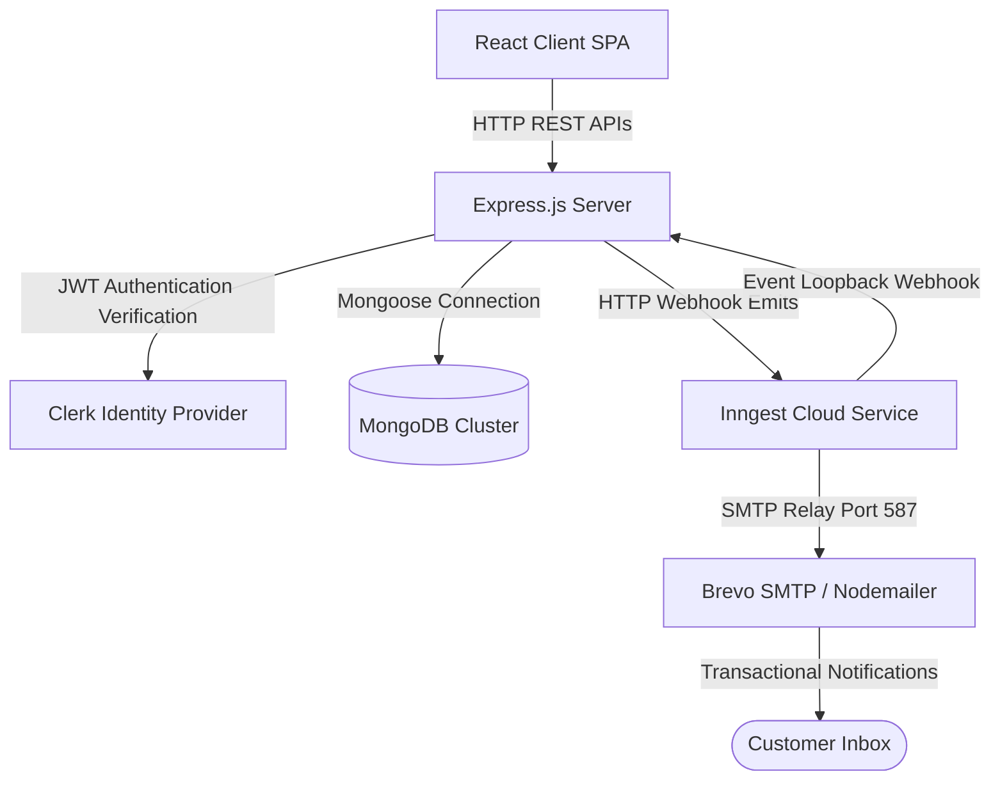

# 🎬 QuickShow Booking System

QuickShow is a modern, full-stack **Movie Ticket Booking Web Application** that enables users to browse now-showing movies, select seats interactively, and manage bookings. It features user authentication synced via Clerk webhooks, film metadata dynamically synchronized from the TMDB API, and automated background tasks orchestrated by Inngest.

Payment processing runs on an instant mock confirmation flow, allowing booking actions to execute securely and immediately under local and private setups without Stripe redirections.

---

## 🎯 Features

### 👤 User Capabilities
* **Dynamic Movie Discovery**: Browse active films with ratings, genres, and cast listings synchronized directly from TMDB.
* **Interactive Seating Grid**: Select specific seat layouts (up to 5 seats per ticket) with real-time seat availability validation.
* **Instant Booking**: Create bookings instantly and get confirmation notifications.
* **Transaction History**: Track reservation logs, seat numbers, times, and confirmation status in your profile.
* **Favorites System**: Save favorite movies directly to your user account (synchronized with Clerk metadata).
* **Auto Notifications**: Receive transaction confirmations and automated show reminders via email.

### 🛠️ Admin Capabilities
* **Management Dashboard**: Monitor system-wide statistics (total bookings, active shows, registered users, and total ticket earnings).
* **Schedule Screenings**: Select active now-playing movies and add new show times with customized ticket prices.
* **Shows & Bookings Logs**: Search and track all showtimes and customer bookings.

---

## 📦 Tech Stack

### Frontend (Client SPA)
* **Framework**: React.js (Vite)
* **Styling**: Tailwind CSS (v4)
* **Routing**: React Router Dom (v7)
* **Authentication**: Clerk React SDK
* **Notifications**: React Hot Toast & Lucide Icons

### Backend (REST API Server)
* **Runtime**: Node.js & Express.js
* **Database**: MongoDB (Mongoose ODM)
* **Authentication**: Clerk Express SDK & Svix
* **Orchestration**: Inngest (Event engine & Crons)
* **Emails**: Nodemailer & SMTP Relays

---

## 🏛️ System Architecture



---

## 🔧 Installation & Local Setup

### Prerequisities
* Node.js (v18 or higher recommended)
* MongoDB (Local instance or MongoDB Atlas Cloud URI)

### 1. Clone the Repository
```bash
git clone https://github.com/Abuthwahir/QuickShow-Booking-System.git
cd QuickShow-Booking-System
```

### 2. Configure Backend Environment
Navigate to the `server` directory and create a `.env` file:
```env
PORT=3000
MONGODB_URI=mongodb+srv://<username>:<password>@cluster.mongodb.net/quickshow
TMDB_API_KEY=your_tmdb_bearer_token
CLERK_PUBLISHABLE_KEY=pk_test_...
CLERK_SECRET_KEY=sk_test_...
SMTP_USER=your_brevo_smtp_username
SMTP_PASS=your_brevo_smtp_password
SENDER_EMAIL=noreply@yourdomain.com
```

### 3. Configure Frontend Environment
Navigate to the `client` directory and create a `.env` file:
```env
VITE_CLERK_PUBLISHABLE_KEY=pk_test_...
VITE_BASE_URL=http://localhost:3000
VITE_TMDB_IMAGE_BASE_URL=https://image.tmdb.org/t/p/w500
VITE_CURRENCY=$
```

---

## 🚀 Running the Application

### Running Backend API
```bash
cd server
npm install
npm run server
```
The server will start listening at `http://localhost:3000`.

### Running Frontend Client
```bash
cd client
npm install
npm run dev
```
The client app will launch at `http://localhost:5173`.

---

## ☁️ Deployment Instructions

### Backend (Express API & Inngest)
1. Deploy the `server/` codebase to host platforms like **Render**, **Heroku**, or **Vercel**.
2. Configure all environment variables in your deployment dashboard settings.
3. Configure the webhook destination in Clerk pointing to `<your_deployed_api_url>/api/inngest` to sync user profiles.

### Frontend (Vite Client)
1. Deploy the `client/` codebase to frontend providers like **Vercel**, **Netlify**, or **GitHub Pages**.
2. Configure environment variables (e.g. `VITE_BASE_URL` pointing to your deployed backend API URL).

---

## 📄 Documentation & Architecture Deep-Dive

For a highly detailed technical manual covering the low-level designs, database query metrics, API specifications, and onboarding steps, please refer to:
* **[explaination.md](explaination.md)**