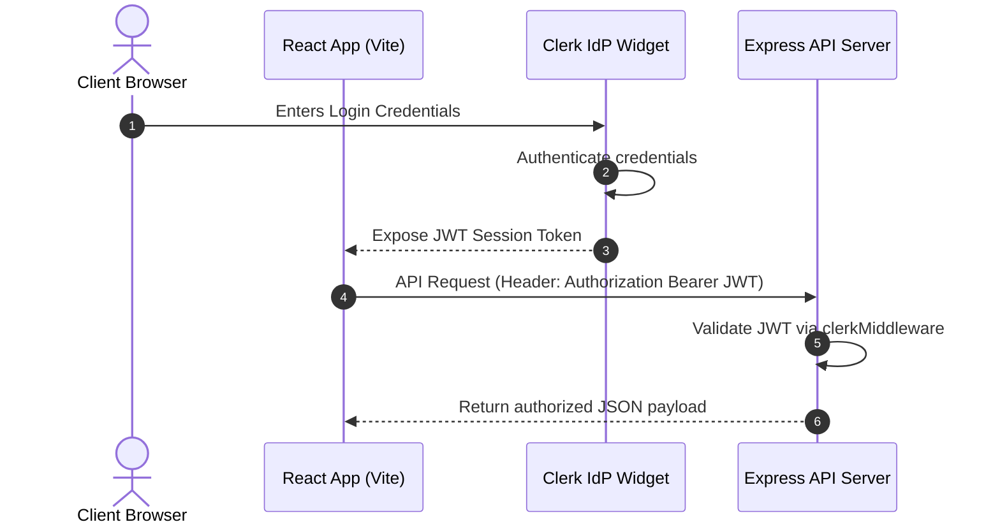
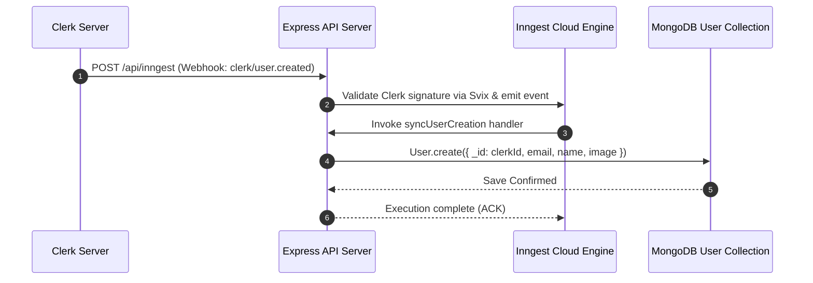
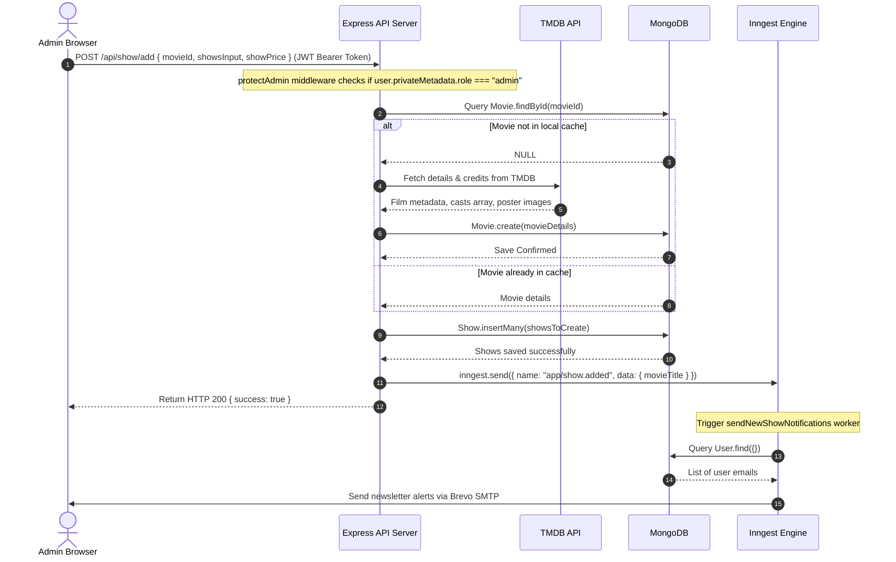
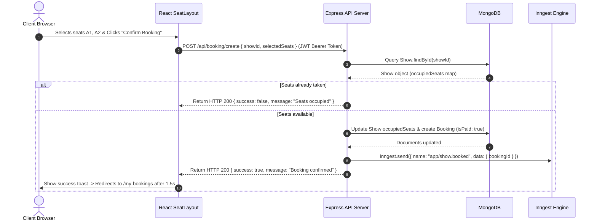
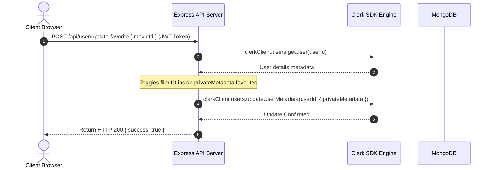
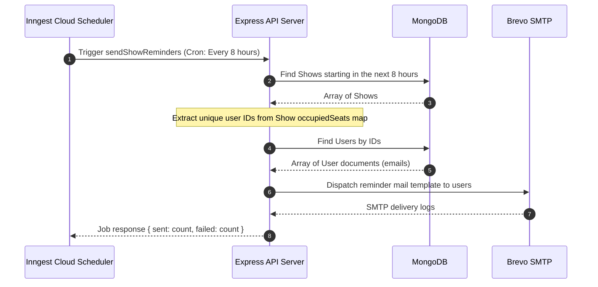

# 🎬 Technical Specification & Architecture Manual: Movie Ticket Booking System

This document is the master developer guide and design manual for the Movie Ticket Booking System. It contains all architectural diagrams, data model blueprints, detailed component explanations, endpoint schemas, security audits, and deployment instructions. It has been updated to reflect the complete removal of Stripe, using an instant mock confirmation flow.

---

## 1. Executive Summary & Architectural Overview

### Project Objective
The Movie Ticket Booking System is a full-stack, decoupled React-Express application designed to streamline the theater reservation lifecycle. It features user authentication, a cached TMDB movie catalog, interactive seat layouts, automated notifications, and an administrative metrics dashboard.

### Core Architecture
The system uses a client-server architecture:
* **Frontend**: A React Single Page Application (SPA) compiled with Vite.
* **Backend**: An Express.js REST API server.
* **Background Tasks (Inngest)**: An event-driven middleware server that communicates with Express via loopback webhooks.
* **Database**: MongoDB (Mongoose ODM).
* **Identity Management**: Clerk (Identity Provider).

### Deployment Architecture
```mermaid
graph TD
    UserClient[React SPA Browser Client] -->|Https Requests| CDN[Vercel CDN / Edge Network]
    CDN -->|Forward Request| NodeAPI[Express API Instance (Render/Vercel)]
    NodeAPI -->|JWT Identity Validation| ClerkService[Clerk IdP API]
    NodeAPI -->|Mongoose connection| MongoDB[(MongoDB Atlas Cluster)]
    NodeAPI -->|HTTP Webhook Event Trigger| Inngest[Inngest Cloud Service]
    Inngest -->|Event Loopback Webhook| NodeAPI
    Inngest -->|SMTP Relay Port 587| Brevo[Brevo SMTP Server]
    Brevo -->|E-mail Dispatch| Inbox([Customer Mailbox])
```

---

## 2. Complete Sequence Diagrams (Mermaid)

### 1. User Login Flow


### 2. User Synchronization Flow


### 3. Add Show Flow


### 4. Booking Flow (Mock Payment Confirmation)


### 5. Favorites Toggle Flow


### 6. Email Reminder Automation Flow


---

## 3. Tech Stack & Dependency Analysis

The application uses specific dependency packages. Below is an audit of the major packages:

### 1. Frontend Packages (`client/package.json`)
* **`react` & `react-dom`** (`v18.3.1`): Core UI library.
* **`@clerk/clerk-react`** (`v5.59.3`): Handles client-side authentication, login screens, user profiles, and session states.
* **`react-router-dom`** (`v7.12.0`): Router engine mapping routes and handling redirects.
* **`axios`** (`v1.13.2`): HTTP client used to interact with the backend APIs. Uses base URL overrides and interceptors.
* **`tailwindcss` & `@tailwindcss/vite`** (`v4.1.18`): CSS utility engine used for interface styling and responsive layouts.
* **`react-hot-toast`** (`v2.6.0`): Displays user notifications.
* **`lucide-react`** (`v0.562.0`): Provides UI icons.
* **`react-player`** (`v3.4.0`): Responsive video player used to embed film trailers.

### 2. Backend Packages (`server/package.json`)
* **`express`** (`v5.2.1`): Web server framework.
* **`mongoose`** (`v9.1.4`): MongoDB Object Data Modeling (ODM) framework.
* **`@clerk/express`** (`v1.7.63`): Parses Authorization headers, validates JWT tokens, and sets `req.auth()`.
* **`inngest`** (`v3.49.3`): Event runner SDK.
* **`nodemailer`** (`v7.0.12`): Connects to SMTP relays to send booking confirmations and show reminders.
* **`svix`** (`v1.84.1`): Validates incoming Clerk webhook payloads.
* **`cors`** (`v2.8.5`): Middleware to handle Cross-Origin Resource Sharing.
* **`dotenv`** (`v17.2.3`): Loads configuration values from `.env` files into `process.env`.

---

## 4. File-by-File Codebase Explanation (Backend & Frontend)

This section provides a file-by-file breakdown of the core application modules.

### ─── Backend Service Layer (Server) ───

#### 1. Entry Point: [server.js](file:///d:/Movie-Ticket-Booking-main/Movie-Ticket-Booking-main/server/server.js)
* **Purpose**: Configures and boots the Express backend web server.
* **Dependencies**: `express`, `cors`, `dotenv`, `@clerk/express`, `inngest`.
* **Logic**:
  - Connects to MongoDB using `connectDB()`.
  - Configures global middleware (CORS, Express JSON body parsing, Clerk authentication middleware).
  - Configures the Inngest middleware handler route at `/api/inngest`.
  - Registers sub-routers: `showRouter` (`/api/show`), `bookingRouter` (`/api/booking`), `adminRouter` (`/api/admin`), and `userRouter` (`/api/user`).
  - Listens on `process.env.PORT || 3000`.

#### 2. DB Configuration: [db.js](file:///d:/Movie-Ticket-Booking-main/Movie-Ticket-Booking-main/server/configs/db.js)
* **Purpose**: Initializes the Mongoose connection to MongoDB.
* **Logic**: Connects to `process.env.MONGODB_URI` database path. Prints a connection confirmation log on success.

#### 3. Mail Client: [nodeMailer.js](file:///d:/Movie-Ticket-Booking-main/Movie-Ticket-Booking-main/server/configs/nodeMailer.js)
* **Purpose**: Handles transactional email delivery.
* **Logic**: Configures a Nodemailer SMTP transporter using Brevo settings:
  - Host: `smtp-relay.brevo.com` (Port `587`).
  - Auth: `SMTP_USER` and `SMTP_PASS` credentials.
  - Exposes `sendEmail({ to, subject, body })` to dispatch HTML emails.

#### 4. Authorization Middleware: [auth.js](file:///d:/Movie-Ticket-Booking-main/Movie-Ticket-Booking-main/server/middleware/auth.js)
* **Purpose**: Enforces admin access control for sensitive backend APIs.
* **Logic**:
  - Extracts the logged-in user's ID using `req.auth()`. Returns HTTP `401 Unauthorized` if not authenticated.
  - Queries the user profile via Clerk SDK: `clerkClient.users.getUser(userId)`.
  - Checks the user's role metadata: `user.privateMetadata?.role`. Returns HTTP `403 Forbidden` if not `"admin"`.

#### 5. Background Jobs Scheduler: [index.js](file:///d:/Movie-Ticket-Booking-main/Movie-Ticket-Booking-main/server/inngest/index.js)
* **Purpose**: Orchestrates background tasks and cron jobs using Inngest.
* **Functions**:
  * `syncUserCreation` (`clerk/user.created`): Inserts user registration data from Clerk webhooks into MongoDB.
  * `syncUserDeletion` (`clerk/user.deleted`): Deletes user records from MongoDB when an account is deleted.
  * `syncUserUpdation` (`clerk/user.updated`): Updates cached user profile details in MongoDB.
  * `sendBookingConfirmationEmail` (`app/show.booked`): Sends booking confirmation emails.
  * `sendNewShowNotifications` (`app/show.added`): Emails all registered users when a new show is added.
  * `sendShowReminders` (Cron: `"0 */8 * * *"`): Runs every 8 hours. Finds shows starting in the next 8 hours and emails reminders to users who booked tickets for those shows.

#### 6. Booking Controller: [bookingController.js](file:///d:/Movie-Ticket-Booking-main/Movie-Ticket-Booking-main/server/controllers/bookingController.js)
* **`createBooking`**:
  * **Input**: `{ showId, selectedSeats }` and `userId`.
  * **Workflow**:
    - Queries the `Show` document by ID.
    - Validates seat availability. Checks if any seat in `selectedSeats` is marked in `show.occupiedSeats`.
    - Updates seat allocations: `show.occupiedSeats[seatID] = userId` for each selected seat.
    - Creates a new booking record with `isPaid: true`.
    - Triggers the `app/show.booked` event via Inngest to send a confirmation email.
    - Returns a success response: `{ success: true, message: "Booking confirmed successfully" }`.
* **`getOccupiedSeats`**: Retrieves the list of occupied seat IDs for a given show: `Object.keys(showData.occupiedSeats)`.

#### 7. Show Controller: [showController.js](file:///d:/Movie-Ticket-Booking-main/Movie-Ticket-Booking-main/server/controllers/showController.js)
* **`getNowPlayingMovies`**: Fetches now-playing movies from the TMDB API (`https://api.themoviedb.org/3/movie/now_playing`) authenticated with a TMDB Bearer Token.
* **`addShow`**:
  - Checks if the selected movie is cached locally. If not, fetches details and cast credits from TMDB (`https://api.themoviedb.org/3/movie/${movieId}` and `/credits`), saves a new `Movie` record, and then maps and inserts the new `Show` records.
* **`getShows`**: Fetches all future shows, maps them to a set of unique movies, and returns them to list under the "Now Showing" page.
* **`getShow`**: Returns movie details and available showtimes grouped by date.

#### 8. Admin Controller: [adminController.js](file:///d:/Movie-Ticket-Booking-main/Movie-Ticket-Booking-main/server/controllers/adminController.js)
* **`isAdmin`**: Simple verification handler. Returns `{ success: true, isAdmin: true }` to verify admin privileges.
* **`getDashboardData`**: Aggregates dashboard metrics: total bookings count, total revenue (sum of paid bookings), list of active shows, and total signed-up users.
* **`getAllShows`**: Lists all upcoming shows sorted chronologically.
* **`getAllBookings`**: Lists all booking logs in the database.

#### 9. User Controller: [userController.js](file:///d:/Movie-Ticket-Booking-main/Movie-Ticket-Booking-main/server/controllers/userController.js)
* **`getUserBookings`**: Returns booking records for the logged-in user, populated with movie titles and runtimes.
* **`updateFavorite`**: Adds or removes film IDs from the user's favorite list stored in Clerk metadata.
* **`getFavorites`**: Fetches the user's favorite movies from their Clerk metadata and queries their details from the database.

---

### ─── React Frontend Layer (Client) ───

#### 1. AppContext Router Container: [AppContext.jsx](file:///d:/Movie-Ticket-Booking-main/Movie-Ticket-Booking-main/client/src/context/AppContext.jsx)
* **Purpose**: Serves as the global state engine for the frontend.
* **State**:
  * `shows`: Loaded dynamically from the backend shows endpoint (`/api/show/all`).
  * `favoriteMovies`: List of user-favorited films.
  * `isAdmin`: Boolean flag showing if the user has the admin role.
* **Functions**:
  * `fetchIsAdmin()`: Calls `/api/admin/is-admin` with the user's JWT token to check admin privileges.
  * `fetchShows()`: Calls `/api/show/all` to fetch active screenings.
  * `fetchFavoriteMovies()`: Calls `/api/user/favorites` to fetch the user's favorite movies.
* **Side Effects**:
  - Automatically loads the shows list on component mount.
  - Triggers role verification and favorite films synchronization once the Clerk user logs in.

#### 2. Homepage: [Home.jsx](file:///d:/Movie-Ticket-Booking-main/Movie-Ticket-Booking-main/client/src/pages/Home.jsx)
* **Purpose**: Renders the homepage layout, displaying `HeroSection` (visual banner), `FeaturedSection` (active now-playing dynamic movies cards grid), and `TrailerSection` (embedded video trailers player).

#### 3. Movies Catalog: [Movies.jsx](file:///d:/Movie-Ticket-Booking-main/Movie-Ticket-Booking-main/client/src/pages/Movies.jsx)
* **Purpose**: Film grid page displaying the list of active now-showing movies. Shows a fallback screen if no active shows are scheduled.

#### 4. Details Dashboard: [MovieDetails.jsx](file:///d:/Movie-Ticket-Booking-main/Movie-Ticket-Booking-main/client/src/pages/MovieDetails.jsx)
* **Purpose**: Displays film attributes, descriptions, runtimes, cast members, and toggles user favorites:
  - Fetches film details from `/api/show/:movieId`.
  - Toggles favorites by posting to `/api/user/update-favorite`.
  - Links to the seating selection view.

#### 5. Seating Page: [SeatLayout.jsx](file:///d:/Movie-Ticket-Booking-main/Movie-Ticket-Booking-main/client/src/pages/SeatLayout.jsx)
* **Purpose**: Seating selection interface.
  - Fetches show details and lists available show times for the selected date.
  - Handles seat selections on the interactive grid (capped at 5).
  - Queries `/api/booking/seats/:showId` to disable already occupied seats.
  - Submits the checkout payload to `/api/booking/create` and redirects to `/loading/my-bookings`.

#### 6. Booking History: [MyBookings.jsx](file:///d:/Movie-Ticket-Booking-main/Movie-Ticket-Booking-main/client/src/pages/MyBookings.jsx)
* **Purpose**: Displays the logged-in user's transaction history. It calls `/api/user/bookings` and displays the booked movie titles, show date/times, seat lists, and status badges.

#### 7. Favorite films grid: [Favorite.jsx](file:///d:/Movie-Ticket-Booking-main/Movie-Ticket-Booking-main/client/src/pages/Favorite.jsx)
* **Purpose**: Renders the list of favorited movies retrieved from the global `AppContext`.

#### 8. Loading page loader: [Loading.jsx](file:///d:/Movie-Ticket-Booking-main/Movie-Ticket-Booking-main/client/src/components/Loading.jsx)
* **Purpose**: Displays a loading spinner before redirecting to the user's booking history.
* **Workflow**: Retrieves the path destination from the URL parameters (`/loading/:nextUrl`). It shows an animated loading spinner for `1500ms` to simulate a processing verification step, then redirects the user to `/my-bookings`.

#### 9. Navbar component: [Navbar.jsx](file:///d:/Movie-Ticket-Booking-main/Movie-Ticket-Booking-main/client/src/components/Navbar.jsx)
* **Purpose**: Site header navigation bar.
* **Logic**: Renders links to Home, Movies, and Favorites. Integrates Clerk's `<UserButton />` and `<SignIn />` widgets to handle user logins and display profiles.

#### 10. Footer Component: [Footer.jsx](file:///d:/Movie-Ticket-Booking-main/Movie-Ticket-Booking-main/client/src/components/Footer.jsx)
* **Purpose**: Displays social download badges, site navigation links, contact details, and copyright messages.

#### 11. Hero Section: [HeroSection.jsx](file:///d:/Movie-Ticket-Booking-main/Movie-Ticket-Booking-main/client/src/components/HeroSection.jsx)
* **Purpose**: Displays the landing page banner details (currently uses hardcoded mock values for *"Guardians of the Galaxy"*).

#### 12. Featured Movies Section: [FeaturedSection.jsx](file:///d:/Movie-Ticket-Booking-main/Movie-Ticket-Booking-main/client/src/components/FeaturedSection.jsx)
* **Purpose**: Displays a grid of the first 4 active movies, linking to the movies catalog page.

#### 13. Trailers Player Section: [TrailerSection.jsx](file:///d:/Movie-Ticket-Booking-main/Movie-Ticket-Booking-main/client/src/components/TrailerSection.jsx)
* **Purpose**: Renders an embedded YouTube video player to play movie trailers. Uses mock data arrays (`dummyTrailers`).

#### 14. Movie Card: [MovieCard.jsx](file:///d:/Movie-Ticket-Booking-main/Movie-Ticket-Booking-main/client/src/components/MovieCard.jsx)
* **Purpose**: Renders movie details (posters, genres, release year, runtime, average rating) in a card view. Links to the movie details page.

#### 15. Date Picker Select: [DateSelect.jsx](file:///d:/Movie-Ticket-Booking-main/Movie-Ticket-Booking-main/client/src/components/DateSelect.jsx)
* **Purpose**: Displays horizontal lists of show dates. Navigates to `/movies/:id/:date` when a date is selected and the user clicks "Book Now".

#### 16. Blur Circle layout: [BlurCircle.jsx](file:///d:/Movie-Ticket-Booking-main/Movie-Ticket-Booking-main/client/src/components/BlurCircle.jsx)
* **Purpose**: Renders absolute-positioned neon glow background circles behind UI views.

#### 17. Admin Navbar layout: [AdminNavbar.jsx](file:///d:/Movie-Ticket-Booking-main/Movie-Ticket-Booking-main/client/src/components/admin/AdminNavbar.jsx)
* **Purpose**: Renders the header navbar for the admin panel.

#### 18. Admin Sidebar navigation: [AdminSidebar.jsx](file:///d:/Movie-Ticket-Booking-main/Movie-Ticket-Booking-main/client/src/components/admin/AdminSidebar.jsx)
* **Purpose**: Admin sidebar. Displays the admin's name, avatar image, and links to Dashboard, Add Shows, List Shows, and List Bookings.

#### 19. Admin Title text: [Title.jsx](file:///d:/Movie-Ticket-Booking-main/Movie-Ticket-Booking-main/client/src/components/admin/Title.jsx)
* **Purpose**: Simple typography component used to render page headers in the admin panel.

---

## 5. API Endpoint Documentation

### 1. Booking API (`/api/booking`)
* **`POST /api/booking/create`**:
  * **Auth**: User Bearer JWT required.
  * **Headers**: `Authorization: Bearer <JWT_TOKEN>`
  * **Request Body**: `{ "showId": "68352363e96d99513e4221a4", "selectedSeats": ["A1", "A2"] }`
  * **Response (HTTP 200)**: `{ "success": true, "message": "Booking confirmed successfully" }`
  * **Response (HTTP 401/403)**: `{ "success": false, "message": "unauthorized" }`
* **`GET /api/booking/seats/:showId`**:
  * **Auth**: Public access.
  * **Response (HTTP 200)**: `{ "success": true, "occupiedSeats": ["A1", "A2", "D5"] }`

### 2. User API (`/api/user`)
* **`GET /api/user/bookings`**:
  * **Auth**: User Bearer JWT required.
  * **Response (HTTP 200)**:
    ```json
    {
      "success": true,
      "bookings": [
        {
          "_id": "68396334fb83252d82e17295",
          "amount": 35.5,
          "bookedSeats": ["A1", "A2"],
          "isPaid": true,
          "show": {
            "showDateTime": "2026-07-24T05:00:00.000Z",
            "movie": { "title": "Lilo & Stitch" }
          }
        }
      ]
    }
    ```
* **`POST /api/user/update-favorite`**:
  * **Auth**: User Bearer JWT required.
  * **Request Body**: `{ "movieId": "552524" }`
  * **Response (HTTP 200)**: `{ "success": true, "message": "Favorite added successfully." }`
* **`GET /api/user/favorites`**:
  * **Auth**: User Bearer JWT required.
  * **Response (HTTP 200)**: `{ "success": true, "movies": [...] }`

### 3. Show API (`/api/show`)
* **`GET /api/show/now-playing`**:
  * **Auth**: Admin Bearer JWT required.
  * **Response (HTTP 200)**: `{ "success": true, "movies": [...] }`
* **`POST /api/show/add`**:
  * **Auth**: Admin Bearer JWT required.
  * **Request Body**:
    ```json
    {
      "movieId": "552524",
      "showsInput": [{ "date": "2026-07-24", "time": ["15:30", "18:30"] }],
      "showPrice": 12
    }
    ```
  * **Response (HTTP 200)**: `{ "success": true, "message": "Show Added successfully." }`
* **`GET /api/show/all`**:
  * **Auth**: Public access.
  * **Response (HTTP 200)**: `{ "success": true, "shows": [...] }` (Lists unique movies with upcoming show dates).
* **`GET /api/show/:movieId`**:
  * **Auth**: Public access.
  * **Response (HTTP 200)**: `{ "success": true, "movie": {...}, "dateTime": { "2026-07-24": [{ "time": "2026-07-24T15:30:00.000Z", "showId": "6835..." }] } }`

### 4. Admin API (`/api/admin`)
* **`GET /api/admin/is-admin`**:
  * **Auth**: Admin Bearer JWT required.
  * **Response (HTTP 200)**: `{ "success": true, "isAdmin": true }`
* **`GET /api/admin/dashboard`**:
  * **Auth**: Admin Bearer JWT required.
  * **Response (HTTP 200)**: `{ "success": true, "dashboardData": { "totalBookings": 14, "totalRevenue": 1517, "activeShows": [...], "totalUser": 5 } }`
* **`GET /api/admin/all-shows`**:
  * **Auth**: Admin Bearer JWT required.
  * **Response (HTTP 200)**: `{ "success": true, "shows": [...] }`
* **`GET /api/admin/all-bookings`**:
  * **Auth**: Admin Bearer JWT required.
  * **Response (HTTP 200)**: `{ "success": true, "bookings": [...] }`

---

## 6. Security Audit & Attack Surface Analysis

### 1. Clerk JWT Tokens
* **Vulnerability**: JWT tokens are passed in client request headers (`Authorization: Bearer <token>`). These tokens are secure against XSS if stored in HTTP-only cookies by Clerk. However, if the frontend context exposes the token in memory, XSS vulnerabilities could allow unauthorized API requests.
* **Fix**: Ensure standard CORS origins are restricted to the production frontend domain to prevent unauthorized API requests.

### 2. Double-Booking Seating Race Condition
* **Vulnerability**: The booking controller checks seat availability using `Show.findById` and updates it using `show.save()`. This is not an atomic operation. Under concurrent traffic, multiple requests could see a seat as available before the first request updates the document, leading to double-bookings.
* **Fix**: Implement atomic check-and-update operations using Mongoose's `findOneAndUpdate`:
  ```javascript
  const confirmedShow = await Show.findOneAndUpdate(
    { _id: showId, [`occupiedSeats.${seatId}`]: { $exists: false } },
    { $set: { [`occupiedSeats.${seatId}`]: userId } },
    { new: true }
  );
  ```

### 3. Missing API Input Validation
* **Vulnerability**: The API controllers process request bodies directly (e.g. `req.body.movieId`, `req.body.selectedSeats`) without validation. This makes the system vulnerable to SQL injection, NoSQL injection, and malformed data payloads.
* **Fix**: Add input validation schemas (such as Zod or Joi) to validate request payloads before processing them in the controllers.

---

## 7. Performance Bottlenecks & Optimization Plan

### 1. Populate Operations
* **Bottleneck**: Deep populate operations (e.g. `Booking.find().populate({ path: 'show', populate: { path: 'movie' } })`) fetch the entire referenced documents. This increases database load and slows down response times.
* **Optimization**: Limit populate queries to fetch only the necessary fields:
  ```javascript
  Booking.find().populate({
    path: 'show',
    select: 'showDateTime showPrice movie',
    populate: { path: 'movie', select: 'title runtime poster_path' }
  });
  ```

### 2. Missing Database Indexes
* **Bottleneck**: The database queries search the `Show` collection using `showDateTime` and the `Booking` collection using `user`. Without indexes, these queries require full collection scans.
* **Optimization**: Create database indexes on these key query fields:
  ```javascript
  showSchema.index({ showDateTime: 1 });
  bookingSchema.index({ user: 1, createdAt: -1 });
  ```

### 3. Lack of Caching
* **Bottleneck**: The film catalog and detail views query MongoDB directly for movie metadata, which rarely changes.
* **Optimization**: Add a Redis cache layer to store movie details and minimize direct MongoDB reads.

---

## 8. Code Quality, Production Readiness & Onboarding

### Developer Onboarding Guide

#### 1. Setup Local Environment Variables
Create a `.env` file in the `server/` directory:
```env
PORT=3000
MONGODB_URI=mongodb+srv://<user>:<password>@cluster.mongodb.net
TMDB_API_KEY=your_tmdb_bearer_token
CLERK_PUBLISHABLE_KEY=pk_test_...
CLERK_SECRET_KEY=sk_test_...
SMTP_USER=brevo_smtp_user
SMTP_PASS=brevo_smtp_password
SENDER_EMAIL=noreply@quickshow.com
```

Create a `.env` file in the `client/` directory:
```env
VITE_CLERK_PUBLISHABLE_KEY=pk_test_...
VITE_BASE_URL=http://localhost:3000
VITE_TMDB_IMAGE_BASE_URL=https://image.tmdb.org/t/p/w500
VITE_CURRENCY=$
```

#### 2. Run the Application
```bash
# In the client directory
npm install
npm run dev

# In the server directory
npm install
npm run server
```

---

### Production Readiness Checklist
1. Re-add a payment gateway integration (like Stripe or PayPal) for production ticket transactions.
2. Implement database indexes on `showDateTime` and `user` query fields.
3. Configure MongoDB transactions or atomic check-and-update operations in `bookingController.js` to prevent double-booking race conditions.
4. Replace hardcoded placeholders in the landing pages (Hero Section, Footer, Admin profile) with dynamic database values.
